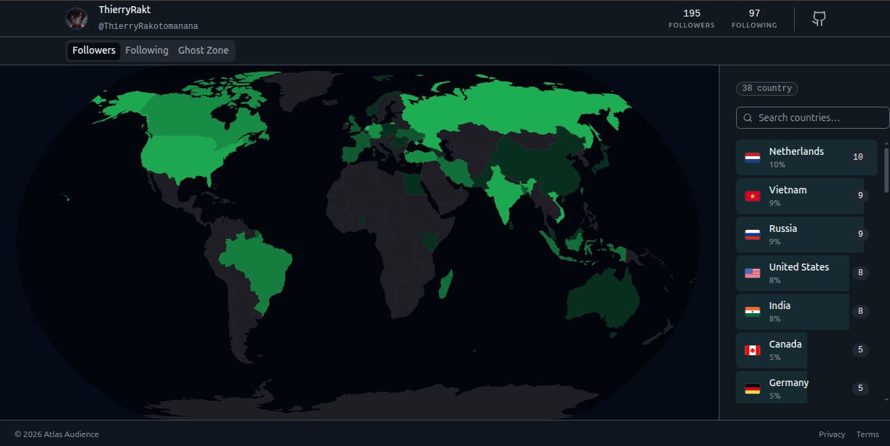
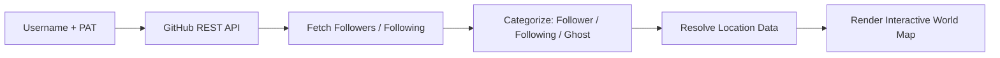

<div align="center">

# 🗺️ GitHub Audience Map

**See exactly who's in your GitHub network : and where they're building from.**

An interactive world map that visualizes the geographic distribution of your followers, the people you follow, and the "ghosts" who don't follow you back.

[](https://github-audience-atlas.vercel.app/)
[](#roadmap)
[](#roadmap)
[](#contributing)
[](#license)

**🔗 [Try it live](https://github-audience-atlas.vercel.app/) : 100% client-side, your token never leaves your browser.**

[Live Demo](https://github-audience-atlas.vercel.app/) • [Features](#-key-features) • [Security](#-security--privacy) • [Quick Start](#-quick-start) • [Usage](#-usage) • [Architecture](#-how-it-works) • [Contributing](#-contributing)

</div>

<br>

<p align="center">
  
</p>

---

## 📖 Table of Contents

- [Overview](#-overview)
- [Security & Privacy](#-security--privacy)
- [Key Features](#-key-features)
- [Tech Stack](#-tech-stack)
- [Prerequisites](#-prerequisites)
- [Quick Start](#-quick-start)
- [Usage](#-usage)
- [How It Works](#-how-it-works)
- [Roadmap](#-roadmap)
- [Contributing](#-contributing)
- [License](#-license)
- [Author & Contact](#-author--contact)

---

## 🎯 Overview

### The Problem

GitHub gives you raw lists of followers and following : but no sense of who these people actually are or where your influence really reaches. It's also easy to lose track of **non-reciprocal relationships**: accounts you follow that never followed back.

### The Solution

**GitHub Audience Map** turns your network data into a single, explorable world map. Point it at any GitHub account and it plots:

- 🌍 Where your **audience** is physically located
- 🌍 Where the people **you learn from** are based
- 👻 Which of them are **ghosts** one way follows with no reciprocity(don't follow you back)

### Why It Matters

| For                                  | Value                                            |
| ------------------------------------ | ------------------------------------------------ |
| **Open-source maintainers**          | Understand the geographic reach of your projects |
| **Developers growing their network** | Spot patterns in who engages with your work      |
| **Anyone curious about their graph** | Clean up one-sided "follows" you no longer need  |

---

## 🔒 Security & Privacy

> **TLDR : Your token never leaves your browser.** This is a static, 100% client-side app. There is no backend, no database, and nothing is logged. Your PAT is used to call the GitHub API directly from your browser and lives only in memory for that page session never written to disk, `localStorage`, `sessionStorage`, or cookies, and gone the moment you refresh or close the tab.

Pasting a token into a random website is normally bad advice, so here's exactly why this one is different, and how to check it yourself instead of taking our word for it:

| Claim                     | What it means                                                                                                                                                             |
| ------------------------- | ------------------------------------------------------------------------------------------------------------------------------------------------------------------------- |
| **No backend**            | The app is a static single-page app. There is no server-side code that can receive, log, or store your token.                                                             |
| **Direct to GitHub only** | Every API call goes straight from your browser to `api.github.com` over HTTPS. Nothing is proxied through any other server.                                               |
| **In-memory only**        | The token is held in JavaScript state for the current session, **not** persisted to `localStorage`, `sessionStorage`, or cookies. It's discarded on refresh or tab close. |
| **Open source**           | The source is public. Don't take this README's word for it, read the code yourself, or fork it and run it locally.                                                        |

**Verify it yourself before pasting in any token:**

1. Open your browser's DevTools → **Network** tab.
2. Paste in a token (ideally a throwaway, read-only one) and generate a map.
3. Confirm every outgoing request goes to `api.github.com` and only there.

> **Best practice still applies.** Use a token scoped to just `read:user`, and revoke it afterward if you're only trying the tool out. This section describes how the app itself is built, it doesn't replace treating any PAT like a password.

---

## ✨ Key Features

> Currently shipping as **v1**. See the [Roadmap](#-roadmap) for what's next.

| Category         | Description                                                                  |
| ---------------- | ---------------------------------------------------------------------------- |
| 👥 **Followers** | Geographic distribution of developers who follow your work                   |
| 🔭 **Following** | Where the people you follow and learn from are located                       |
| 👻 **Ghosts**    | Non-reciprocal relationships, accounts you follow that don't follow you back |

---

## 🛠️ Tech Stack

> **Note:** The fields below are placeholders : replace them with your project's actual stack so contributors know what they're working with before they clone the repo.

| Layer                   | Technology                                         |
| ----------------------- | -------------------------------------------------- |
| Frontend                | `React, Vite, TypeScript`                          |
| Mapping / Visualization | `Custom Geocoding & D3`                            |
| Data Source             | [GitHub REST API](https://docs.github.com/en/rest) |
| Hosting / Deployment    | `GitHub  / Vercel`                                 |
| Package Manager         | `npm`                                              |

---

## ✅ Prerequisites

Before you begin, make sure you have:

- A **GitHub account**
- A **GitHub Personal Access Token (PAT)** see below

### Generating a Personal Access Token

1. Go to **GitHub → Settings → Developer settings → Personal access tokens**.
2. Generate a new token with the following scope:

   | Scope       | Why it's needed                               |
   | ----------- | --------------------------------------------- |
   | `read:user` | Read your profile and follower/following data |

> **🔒 Security Note**
> Treat your PAT like a password regardless of where you paste it. See [Security & Privacy](#-security--privacy) for exactly how this app handles your token (spoiler: it never leaves your browser).

> **📌 Looking ahead:** the planned "Direct Unfollow" feature (see [Roadmap](#-roadmap)) will require the additional `user:follow` scope. You don't need it for v1.

---

## 🚀 Quick Start

### Option A : Use the Live App (fastest)

No install required, just open **[github-audience-atlas.vercel.app](https://github-audience-atlas.vercel.app/)** and go straight to [Usage](#-usage). See [Security & Privacy](#-security--privacy) for how your token is (and isn't) handled.

### Option B : Run It Locally

```bash
# 1. Clone the repository
git clone https://github.com/ThierryRakotomanana/github-audience-atlas.git
cd <repo-name>

# 2. Install dependencies
npm install

# 3. Start the app
npm run dev
```

### Environment Variables

If you prefer supplying your token via environment variable instead of pasting it into the UI each time, create a `.env` file in the project root:

| Variable       | Required | Description                | Example                    |
| -------------- | -------- | -------------------------- | -------------------------- |
| `GITHUB_TOKEN` | Optional | Your Personal Access Token | `ghp_xxxxxxxxxxxxxxxxxxxx` |

```bash
# .env.example
GITHUB_TOKEN=your_personal_access_token_here
```

> ⚠️ Add `.env` to your `.gitignore` : never commit real tokens.

---

## 💻 Usage

1. **Launch** the app, open the [live version](https://github-audience-atlas.vercel.app/), or run it locally with `npm run dev`.
2. **Enter** your GitHub username.
3. **Paste** your Personal Access Token.
4. Click **Generate Map** and explore your network on the interactive globe.

---

## 🧩 How It Works

At a high level, the app follows this pipeline:



1. **Fetch** : Authenticated calls to the GitHub REST API retrieve your followers and following lists.
2. **Categorize** : Accounts are cross-referenced to identify followers, following, and non-reciprocal "ghosts."
3. **Resolve** : Each account's public location field is used to place it on the map.
4. **Render** : Results are plotted on an interactive, explorable world map.

---

## 🗺️ Roadmap

Planned for upcoming releases:

| Status | Feature                  | Description                                           | Notes                            |
| ------ | ------------------------ | ----------------------------------------------------- | -------------------------------- |
| ⬜     | **Direct Unfollow**      | Unfollow "ghosts" straight from the map interface     | Requires `user:follow` PAT scope |
| ⬜     | **Unmapped Users View**  | Dedicated list for accounts without location data     |                                  |
| ⬜     | **Advanced Color Modes** | Heatmap, radar view, and a "Contribution Green" theme |                                  |
| ⬜     | **UI/UX Overhaul**       | Ongoing improvements to interface and user flow       |                                  |

Have an idea? [Open an issue](../../issues) to suggest a feature.

---

## 🤝 Contributing

Contributions are welcome! To get started:

1. **Fork** the repository.
2. **Create a branch** for your change:
   ```bash
   git checkout -b feature/your-feature-name
   ```
3. **Make your changes** and commit with a clear message:
   ```bash
   git commit -m "feat: add heatmap rendering mode"
   ```
4. **Push** and open a **Pull Request** describing what you changed and why.

> **Good first issues** are a great place to start : check the [Issues tab](../../issues) for anything labeled `good first issue` or pick an unchecked item from the [Roadmap](#-roadmap).

---

## 📄 License

> Distributed under the **MIT License**. See `LICENSE` for details.

---

## 👤 Author & Contact

Built and maintained by **Thierry Rakotomanana**.

If you find this project useful, consider following along : new tools and open-source contributions are shared regularly.

[](https://github.com/ThierryRakotomanana)

[](https://twitter.com/ThieryRakt)
